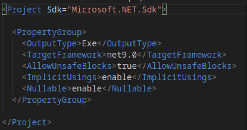

# Implementación de Lista Simple en C# con Punteros (Unsafe)

Este ejemplo muestra cómo implementar una lista enlazada simple en C# utilizando punteros y memoria no administrada (`unsafe`).

## Estructura del Nodo

La estructura `Nodo<T>` representa un nodo en la lista. Cada nodo contiene:
- `Data`: El valor almacenado en el nodo.
- `Sig`: Un puntero al siguiente nodo de la lista.

## Clase `ListaSimple<T>`

La clase `ListaSimple<T>` gestiona la lista enlazada y tiene varias operaciones:

- **Insertar**: Permite añadir un nuevo nodo al final de la lista. El nuevo nodo se crea usando memoria no administrada.
- **Imprimir**: Muestra los valores almacenados en cada nodo de la lista, recorriéndola desde la cabeza hasta el final.

La memoria de los nodos se maneja explícitamente utilizando funciones de `Marshal`, que permiten asignar y liberar memoria no administrada, evitando las fugas de memoria.

## Program

En el programa principal, se crea una instancia de la lista, se insertan algunos elementos.

## Habilitar el Uso de Punteros en el Proyecto

Para permitir el uso de punteros en C#, es necesario habilitar el código `unsafe` en el archivo `.csproj`. Esto se hace agregando una propiedad en el archivo del proyecto que permita bloques `unsafe`. 

El atributo `<AllowUnsafeBlocks>` debe establecerse en `true` para habilitar este tipo de código.

Esto se relizara en el archivo que con extension: .csproj:

Captura completa:

